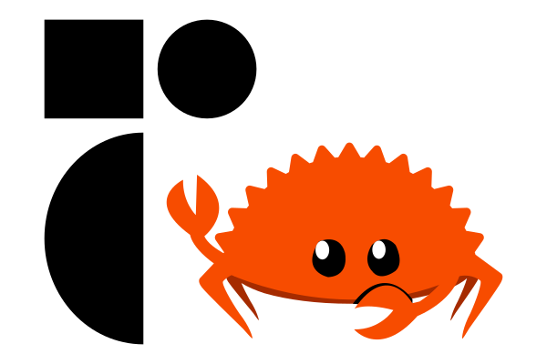

    

# Introduction

Pith UI is a Rust port of [Radix](https://www.radix-ui.com/primitives).

[Radix](https://www.radix-ui.com/) is a library of components, icons, colors, and templates for building high-quality, accessible UI.

## Parts

Pith UI consists of the following parts:

- [Colors](./colors)
- [Icons](./icons)
- [Primitives](./primitives)
- [Themes](./themes)

## Frameworks

Pith UI is available for the following frameworks:

- [Dioxus](https://dioxuslabs.com/)
- [Leptos](https://leptos.dev/)
- [Yew](https://yew.rs/)

The tables below show the support for the various frameworks.

- ✅ = Supported
- 🟦 = Early Support
- 🚧 = Work In Progress
- ❌ = Unsupported

### Colors Support

| Name   | Framework Independent |
| ------ | --------------------- |
| Colors | ✅                    |

### Icons Support

| Name  | Dioxus | Leptos | Yew |
| ----- | ------ | ------ | --- |
| Icons | ✅     | ✅     | ✅  |

### Primitives Support

| Name                   | Dioxus                                                    | Leptos                                                  | Yew                                                       |
| ---------------------- | --------------------------------------------------------- | ------------------------------------------------------- | --------------------------------------------------------- |
| Accessible Icon        | ❌ [#120](https://github.com/pith-ui/pith-ui/issues/120) | 🚧 [#17](https://github.com/pith-ui/pith-ui/issues/17) | ❌ [#69](https://github.com/pith-ui/pith-ui/issues/69)   |
| Accordion              | ❌ [#121](https://github.com/pith-ui/pith-ui/issues/121) | ❌ [#18](https://github.com/pith-ui/pith-ui/issues/18) | ❌ [#70](https://github.com/pith-ui/pith-ui/issues/70)   |
| Alert Dialog           | ❌ [#122](https://github.com/pith-ui/pith-ui/issues/122) | ❌ [#19](https://github.com/pith-ui/pith-ui/issues/19) | ❌ [#71](https://github.com/pith-ui/pith-ui/issues/71)   |
| Arrow                  | ❌ [#123](https://github.com/pith-ui/pith-ui/issues/123) | 🚧 [#20](https://github.com/pith-ui/pith-ui/issues/20) | 🚧 [#72](https://github.com/pith-ui/pith-ui/issues/72)   |
| Aspect Ratio           | ❌ [#124](https://github.com/pith-ui/pith-ui/issues/124) | 🟦 [#21](https://github.com/pith-ui/pith-ui/issues/21) | ❌ [#73](https://github.com/pith-ui/pith-ui/issues/73)   |
| Avatar                 | ❌ [#125](https://github.com/pith-ui/pith-ui/issues/125) | 🚧 [#22](https://github.com/pith-ui/pith-ui/issues/22) | 🚧 [#74](https://github.com/pith-ui/pith-ui/issues/74)   |
| Checkbox               | ❌ [#126](https://github.com/pith-ui/pith-ui/issues/126) | 🚧 [#23](https://github.com/pith-ui/pith-ui/issues/23) | 🟦 [#75](https://github.com/pith-ui/pith-ui/issues/75)   |
| Collapsible            | ❌ [#127](https://github.com/pith-ui/pith-ui/issues/127) | ❌ [#24](https://github.com/pith-ui/pith-ui/issues/24) | ❌ [#76](https://github.com/pith-ui/pith-ui/issues/76)   |
| Collection             | ❌ [#128](https://github.com/pith-ui/pith-ui/issues/128) | 🟦 [#25](https://github.com/pith-ui/pith-ui/issues/25) | 🟦 [#77](https://github.com/pith-ui/pith-ui/issues/77)   |
| Compose Refs           | ❌ [#129](https://github.com/pith-ui/pith-ui/issues/129) | 🟦 [#26](https://github.com/pith-ui/pith-ui/issues/26) | 🟦 [#78](https://github.com/pith-ui/pith-ui/issues/78)   |
| Context Menu           | ❌ [#130](https://github.com/pith-ui/pith-ui/issues/130) | ❌ [#27](https://github.com/pith-ui/pith-ui/issues/27) | ❌ [#79](https://github.com/pith-ui/pith-ui/issues/79)   |
| Context                | ❌ [#131](https://github.com/pith-ui/pith-ui/issues/131) | ❌ [#28](https://github.com/pith-ui/pith-ui/issues/28) | ❌ [#80](https://github.com/pith-ui/pith-ui/issues/80)   |
| Dialog                 | ❌ [#132](https://github.com/pith-ui/pith-ui/issues/132) | ❌ [#29](https://github.com/pith-ui/pith-ui/issues/29) | 🚧 [#81](https://github.com/pith-ui/pith-ui/issues/81)   |
| Direction              | ❌ [#133](https://github.com/pith-ui/pith-ui/issues/133) | 🟦 [#30](https://github.com/pith-ui/pith-ui/issues/30) | 🟦 [#82](https://github.com/pith-ui/pith-ui/issues/82)   |
| Dismissable Layer      | ❌ [#134](https://github.com/pith-ui/pith-ui/issues/134) | 🚧 [#31](https://github.com/pith-ui/pith-ui/issues/31) | 🚧 [#83](https://github.com/pith-ui/pith-ui/issues/83)   |
| Dropdown Menu          | ❌ [#135](https://github.com/pith-ui/pith-ui/issues/135) | ❌ [#32](https://github.com/pith-ui/pith-ui/issues/32) | ❌ [#84](https://github.com/pith-ui/pith-ui/issues/84)   |
| Focus Guards           | ❌ [#136](https://github.com/pith-ui/pith-ui/issues/136) | 🟦 [#33](https://github.com/pith-ui/pith-ui/issues/33) | 🟦 [#85](https://github.com/pith-ui/pith-ui/issues/85)   |
| Focus Scope            | ❌ [#137](https://github.com/pith-ui/pith-ui/issues/137) | 🚧 [#34](https://github.com/pith-ui/pith-ui/issues/34) | 🚧 [#86](https://github.com/pith-ui/pith-ui/issues/86)   |
| Form                   | ❌ [#138](https://github.com/pith-ui/pith-ui/issues/138) | ❌ [#35](https://github.com/pith-ui/pith-ui/issues/35) | ❌ [#87](https://github.com/pith-ui/pith-ui/issues/87)   |
| Hover Card             | ❌ [#139](https://github.com/pith-ui/pith-ui/issues/139) | ❌ [#36](https://github.com/pith-ui/pith-ui/issues/36) | ❌ [#88](https://github.com/pith-ui/pith-ui/issues/88)   |
| ID                     | ❌                                                        | 🟦                                                      | 🟦                                                        |
| Label                  | ❌ [#140](https://github.com/pith-ui/pith-ui/issues/140) | 🟦 [#37](https://github.com/pith-ui/pith-ui/issues/37) | 🟦 [#89](https://github.com/pith-ui/pith-ui/issues/89)   |
| Menu                   | ❌ [#141](https://github.com/pith-ui/pith-ui/issues/141) | 🚧 [#38](https://github.com/pith-ui/pith-ui/issues/38) | ❌ [#90](https://github.com/pith-ui/pith-ui/issues/90)   |
| Menubar                | ❌ [#142](https://github.com/pith-ui/pith-ui/issues/142) | ❌ [#39](https://github.com/pith-ui/pith-ui/issues/39) | ❌ [#91](https://github.com/pith-ui/pith-ui/issues/91)   |
| Navigation Menu        | ❌ [#143](https://github.com/pith-ui/pith-ui/issues/143) | ❌ [#40](https://github.com/pith-ui/pith-ui/issues/40) | ❌ [#92](https://github.com/pith-ui/pith-ui/issues/92)   |
| Popover                | ❌ [#144](https://github.com/pith-ui/pith-ui/issues/144) | ❌ [#41](https://github.com/pith-ui/pith-ui/issues/41) | ❌ [#93](https://github.com/pith-ui/pith-ui/issues/93)   |
| Popper                 | ❌ [#145](https://github.com/pith-ui/pith-ui/issues/145) | 🟦 [#42](https://github.com/pith-ui/pith-ui/issues/42) | 🚧 [#94](https://github.com/pith-ui/pith-ui/issues/94)   |
| Portal                 | ❌ [#146](https://github.com/pith-ui/pith-ui/issues/146) | 🟦 [#43](https://github.com/pith-ui/pith-ui/issues/43) | 🟦 [#95](https://github.com/pith-ui/pith-ui/issues/95)   |
| Presence               | ❌ [#147](https://github.com/pith-ui/pith-ui/issues/147) | 🟦 [#44](https://github.com/pith-ui/pith-ui/issues/44) | 🟦 [#96](https://github.com/pith-ui/pith-ui/issues/96)   |
| Primitive              | ❌ [#148](https://github.com/pith-ui/pith-ui/issues/148) | 🟦 [#45](https://github.com/pith-ui/pith-ui/issues/45) | 🟦 [#97](https://github.com/pith-ui/pith-ui/issues/97)   |
| Progress               | ❌ [#149](https://github.com/pith-ui/pith-ui/issues/150) | 🟦 [#46](https://github.com/pith-ui/pith-ui/issues/46) | ❌ [#98](https://github.com/pith-ui/pith-ui/issues/98)   |
| Radio Group            | ❌ [#150](https://github.com/pith-ui/pith-ui/issues/150) | ❌ [#47](https://github.com/pith-ui/pith-ui/issues/47) | ❌ [#99](https://github.com/pith-ui/pith-ui/issues/99)   |
| Roving Focus           | ❌ [#151](https://github.com/pith-ui/pith-ui/issues/151) | 🚧 [#48](https://github.com/pith-ui/pith-ui/issues/48) | ❌ [#100](https://github.com/pith-ui/pith-ui/issues/100) |
| Scroll Area            | ❌ [#152](https://github.com/pith-ui/pith-ui/issues/152) | ❌ [#49](https://github.com/pith-ui/pith-ui/issues/49) | ❌ [#101](https://github.com/pith-ui/pith-ui/issues/101) |
| Select                 | ❌ [#153](https://github.com/pith-ui/pith-ui/issues/153) | ❌ [#50](https://github.com/pith-ui/pith-ui/issues/50) | 🚧 [#102](https://github.com/pith-ui/pith-ui/issues/102) |
| Separator              | ❌ [#154](https://github.com/pith-ui/pith-ui/issues/154) | 🟦 [#51](https://github.com/pith-ui/pith-ui/issues/51) | 🟦 [#103](https://github.com/pith-ui/pith-ui/issues/103) |
| Slider                 | ❌ [#155](https://github.com/pith-ui/pith-ui/issues/155) | ❌ [#52](https://github.com/pith-ui/pith-ui/issues/52) | ❌ [#104](https://github.com/pith-ui/pith-ui/issues/104) |
| Slot                   | ❌ [#156](https://github.com/pith-ui/pith-ui/issues/156) | 🚧 [#53](https://github.com/pith-ui/pith-ui/issues/53) | ❌ [#105](https://github.com/pith-ui/pith-ui/issues/105) |
| Switch                 | ❌ [#157](https://github.com/pith-ui/pith-ui/issues/157) | 🟦 [#54](https://github.com/pith-ui/pith-ui/issues/54) | 🟦 [#106](https://github.com/pith-ui/pith-ui/issues/106) |
| Tabs                   | ❌ [#158](https://github.com/pith-ui/pith-ui/issues/158) | ❌ [#55](https://github.com/pith-ui/pith-ui/issues/55) | ❌ [#107](https://github.com/pith-ui/pith-ui/issues/107) |
| Toast                  | ❌ [#159](https://github.com/pith-ui/pith-ui/issues/159) | ❌ [#56](https://github.com/pith-ui/pith-ui/issues/56) | ❌ [#108](https://github.com/pith-ui/pith-ui/issues/108) |
| Toggle Group           | ❌ [#160](https://github.com/pith-ui/pith-ui/issues/160) | ❌ [#57](https://github.com/pith-ui/pith-ui/issues/57) | ❌ [#109](https://github.com/pith-ui/pith-ui/issues/109) |
| Toggle                 | ❌ [#161](https://github.com/pith-ui/pith-ui/issues/161) | 🚧 [#58](https://github.com/pith-ui/pith-ui/issues/58) | ❌ [#110](https://github.com/pith-ui/pith-ui/issues/110) |
| Toolbar                | ❌ [#162](https://github.com/pith-ui/pith-ui/issues/162) | ❌ [#59](https://github.com/pith-ui/pith-ui/issues/59) | ❌ [#111](https://github.com/pith-ui/pith-ui/issues/111) |
| Tooltip                | ❌ [#163](https://github.com/pith-ui/pith-ui/issues/163) | ❌ [#60](https://github.com/pith-ui/pith-ui/issues/60) | 🚧 [#112](https://github.com/pith-ui/pith-ui/issues/112) |
| Use Callback Ref       | ❌                                                        | ❌                                                      | ❌                                                        |
| Use Controllable State | ❌ [#164](https://github.com/pith-ui/pith-ui/issues/164) | 🟦 [#61](https://github.com/pith-ui/pith-ui/issues/61) | 🟦 [#113](https://github.com/pith-ui/pith-ui/issues/113) |
| Use Escape Keydown     | ❌ [#165](https://github.com/pith-ui/pith-ui/issues/165) | 🟦 [#62](https://github.com/pith-ui/pith-ui/issues/62) | ❌ [#114](https://github.com/pith-ui/pith-ui/issues/114) |
| Use Layout Effect      | ❌                                                        | ❌                                                      | ❌                                                        |
| Use Previous           | ❌ [#166](https://github.com/pith-ui/pith-ui/issues/166) | 🟦 [#63](https://github.com/pith-ui/pith-ui/issues/63) | 🟦 [#115](https://github.com/pith-ui/pith-ui/issues/115) |
| Use Rect               | ❌ [#167](https://github.com/pith-ui/pith-ui/issues/167) | ❌ [#64](https://github.com/pith-ui/pith-ui/issues/64) | ❌ [#116](https://github.com/pith-ui/pith-ui/issues/116) |
| Use Size               | ❌ [#168](https://github.com/pith-ui/pith-ui/issues/168) | 🟦 [#65](https://github.com/pith-ui/pith-ui/issues/65) | 🟦 [#117](https://github.com/pith-ui/pith-ui/issues/117) |
| Visually Hidden        | ❌ [#169](https://github.com/pith-ui/pith-ui/issues/169) | 🟦 [#66](https://github.com/pith-ui/pith-ui/issues/66) | 🟦 [#118](https://github.com/pith-ui/pith-ui/issues/118) |
| **Total**              | 0 / 52                                                    | 29 / 52                                                 | 24 / 52                                                   |

### Themes Support

| Name              | Dioxus                                                    | Leptos                                                    | Yew                                                       |
| ----------------- | --------------------------------------------------------- | --------------------------------------------------------- | --------------------------------------------------------- |
| Accessible Icon   | ❌ [#172](https://github.com/pith-ui/pith-ui/issues/172) | ❌ [#231](https://github.com/pith-ui/pith-ui/issues/231) | ❌ [#290](https://github.com/pith-ui/pith-ui/issues/290) |
| Alert Dialog      | ❌ [#173](https://github.com/pith-ui/pith-ui/issues/173) | ❌ [#232](https://github.com/pith-ui/pith-ui/issues/232) | ❌ [#291](https://github.com/pith-ui/pith-ui/issues/291) |
| Aspect Ratio      | ❌ [#174](https://github.com/pith-ui/pith-ui/issues/174) | ❌ [#233](https://github.com/pith-ui/pith-ui/issues/233) | 🟦 [#292](https://github.com/pith-ui/pith-ui/issues/292) |
| Avatar            | ❌ [#175](https://github.com/pith-ui/pith-ui/issues/175) | ❌ [#234](https://github.com/pith-ui/pith-ui/issues/234) | 🟦 [#293](https://github.com/pith-ui/pith-ui/issues/293) |
| Badge             | ❌ [#176](https://github.com/pith-ui/pith-ui/issues/176) | ❌ [#235](https://github.com/pith-ui/pith-ui/issues/235) | 🟦 [#294](https://github.com/pith-ui/pith-ui/issues/294) |
| Base Button       | ❌ [#177](https://github.com/pith-ui/pith-ui/issues/177) | ❌ [#236](https://github.com/pith-ui/pith-ui/issues/236) | 🟦 [#295](https://github.com/pith-ui/pith-ui/issues/295) |
| Blockquote        | ❌ [#178](https://github.com/pith-ui/pith-ui/issues/178) | ❌ [#237](https://github.com/pith-ui/pith-ui/issues/237) | 🟦 [#296](https://github.com/pith-ui/pith-ui/issues/296) |
| Box               | ❌ [#179](https://github.com/pith-ui/pith-ui/issues/179) | ❌ [#238](https://github.com/pith-ui/pith-ui/issues/238) | 🟦 [#297](https://github.com/pith-ui/pith-ui/issues/297) |
| Button            | ❌ [#180](https://github.com/pith-ui/pith-ui/issues/180) | ❌ [#239](https://github.com/pith-ui/pith-ui/issues/239) | 🟦 [#298](https://github.com/pith-ui/pith-ui/issues/298) |
| Callout           | ❌ [#181](https://github.com/pith-ui/pith-ui/issues/181) | ❌ [#240](https://github.com/pith-ui/pith-ui/issues/240) | 🟦 [#299](https://github.com/pith-ui/pith-ui/issues/299) |
| Card              | ❌ [#182](https://github.com/pith-ui/pith-ui/issues/182) | ❌ [#241](https://github.com/pith-ui/pith-ui/issues/241) | 🟦 [#300](https://github.com/pith-ui/pith-ui/issues/300) |
| Checkbox Cards    | ❌ [#183](https://github.com/pith-ui/pith-ui/issues/183) | ❌ [#242](https://github.com/pith-ui/pith-ui/issues/242) | ❌ [#301](https://github.com/pith-ui/pith-ui/issues/301) |
| Checkbox Group    | ❌ [#184](https://github.com/pith-ui/pith-ui/issues/184) | ❌ [#243](https://github.com/pith-ui/pith-ui/issues/243) | ❌ [#302](https://github.com/pith-ui/pith-ui/issues/302) |
| Checkbox          | ❌ [#185](https://github.com/pith-ui/pith-ui/issues/185) | ❌ [#244](https://github.com/pith-ui/pith-ui/issues/244) | 🟦 [#303](https://github.com/pith-ui/pith-ui/issues/303) |
| Code              | ❌ [#186](https://github.com/pith-ui/pith-ui/issues/186) | ❌ [#245](https://github.com/pith-ui/pith-ui/issues/245) | 🟦 [#304](https://github.com/pith-ui/pith-ui/issues/304) |
| Container         | ❌ [#187](https://github.com/pith-ui/pith-ui/issues/187) | ❌ [#246](https://github.com/pith-ui/pith-ui/issues/246) | 🟦 [#305](https://github.com/pith-ui/pith-ui/issues/305) |
| Context Menu      | ❌ [#188](https://github.com/pith-ui/pith-ui/issues/188) | ❌ [#247](https://github.com/pith-ui/pith-ui/issues/247) | ❌ [#306](https://github.com/pith-ui/pith-ui/issues/306) |
| Data List         | ❌ [#189](https://github.com/pith-ui/pith-ui/issues/189) | ❌ [#248](https://github.com/pith-ui/pith-ui/issues/248) | 🟦 [#307](https://github.com/pith-ui/pith-ui/issues/307) |
| Dialog            | ❌ [#190](https://github.com/pith-ui/pith-ui/issues/190) | ❌ [#249](https://github.com/pith-ui/pith-ui/issues/249) | ❌ [#308](https://github.com/pith-ui/pith-ui/issues/308) |
| Dropdown Menu     | ❌ [#191](https://github.com/pith-ui/pith-ui/issues/191) | ❌ [#250](https://github.com/pith-ui/pith-ui/issues/250) | ❌ [#309](https://github.com/pith-ui/pith-ui/issues/309) |
| Em                | ❌ [#192](https://github.com/pith-ui/pith-ui/issues/192) | ❌ [#251](https://github.com/pith-ui/pith-ui/issues/251) | 🟦 [#310](https://github.com/pith-ui/pith-ui/issues/310) |
| Flex              | ❌ [#193](https://github.com/pith-ui/pith-ui/issues/193) | ❌ [#252](https://github.com/pith-ui/pith-ui/issues/252) | 🟦 [#311](https://github.com/pith-ui/pith-ui/issues/311) |
| Grid              | ❌ [#194](https://github.com/pith-ui/pith-ui/issues/194) | ❌ [#253](https://github.com/pith-ui/pith-ui/issues/253) | 🟦 [#312](https://github.com/pith-ui/pith-ui/issues/312) |
| Heading           | ❌ [#195](https://github.com/pith-ui/pith-ui/issues/195) | ❌ [#254](https://github.com/pith-ui/pith-ui/issues/254) | 🟦 [#313](https://github.com/pith-ui/pith-ui/issues/313) |
| Hover Card        | ❌ [#196](https://github.com/pith-ui/pith-ui/issues/196) | ❌ [#255](https://github.com/pith-ui/pith-ui/issues/255) | ❌ [#314](https://github.com/pith-ui/pith-ui/issues/314) |
| Icon Button       | ❌ [#197](https://github.com/pith-ui/pith-ui/issues/197) | ❌ [#256](https://github.com/pith-ui/pith-ui/issues/256) | 🟦 [#315](https://github.com/pith-ui/pith-ui/issues/315) |
| Icons             | ❌ [#198](https://github.com/pith-ui/pith-ui/issues/198) | ❌ [#257](https://github.com/pith-ui/pith-ui/issues/257) | 🟦 [#316](https://github.com/pith-ui/pith-ui/issues/316) |
| Inset             | ❌ [#199](https://github.com/pith-ui/pith-ui/issues/199) | ❌ [#258](https://github.com/pith-ui/pith-ui/issues/258) | 🟦 [#317](https://github.com/pith-ui/pith-ui/issues/317) |
| Kbd               | ❌ [#200](https://github.com/pith-ui/pith-ui/issues/200) | ❌ [#259](https://github.com/pith-ui/pith-ui/issues/259) | 🟦 [#318](https://github.com/pith-ui/pith-ui/issues/318) |
| Link              | ❌ [#201](https://github.com/pith-ui/pith-ui/issues/201) | ❌ [#260](https://github.com/pith-ui/pith-ui/issues/260) | 🟦 [#319](https://github.com/pith-ui/pith-ui/issues/319) |
| Popover           | ❌ [#202](https://github.com/pith-ui/pith-ui/issues/202) | ❌ [#261](https://github.com/pith-ui/pith-ui/issues/261) | ❌ [#320](https://github.com/pith-ui/pith-ui/issues/320) |
| Portal            | ❌ [#203](https://github.com/pith-ui/pith-ui/issues/203) | ❌ [#262](https://github.com/pith-ui/pith-ui/issues/262) | 🟦 [#321](https://github.com/pith-ui/pith-ui/issues/321) |
| Progress          | ❌ [#204](https://github.com/pith-ui/pith-ui/issues/204) | ❌ [#263](https://github.com/pith-ui/pith-ui/issues/263) | ❌ [#322](https://github.com/pith-ui/pith-ui/issues/322) |
| Quote             | ❌ [#205](https://github.com/pith-ui/pith-ui/issues/205) | ❌ [#264](https://github.com/pith-ui/pith-ui/issues/264) | 🟦 [#323](https://github.com/pith-ui/pith-ui/issues/323) |
| Radio Cards       | ❌ [#206](https://github.com/pith-ui/pith-ui/issues/206) | ❌ [#265](https://github.com/pith-ui/pith-ui/issues/265) | ❌ [#324](https://github.com/pith-ui/pith-ui/issues/324) |
| Radio Group       | ❌ [#207](https://github.com/pith-ui/pith-ui/issues/207) | ❌ [#266](https://github.com/pith-ui/pith-ui/issues/266) | ❌ [#325](https://github.com/pith-ui/pith-ui/issues/325) |
| Radio             | ❌ [#208](https://github.com/pith-ui/pith-ui/issues/208) | ❌ [#267](https://github.com/pith-ui/pith-ui/issues/267) | 🟦 [#326](https://github.com/pith-ui/pith-ui/issues/326) |
| Reset             | ❌ [#209](https://github.com/pith-ui/pith-ui/issues/209) | ❌ [#268](https://github.com/pith-ui/pith-ui/issues/268) | ❌ [#327](https://github.com/pith-ui/pith-ui/issues/327) |
| Scroll Area       | ❌ [#210](https://github.com/pith-ui/pith-ui/issues/210) | ❌ [#269](https://github.com/pith-ui/pith-ui/issues/269) | ❌ [#328](https://github.com/pith-ui/pith-ui/issues/328) |
| Section           | ❌ [#211](https://github.com/pith-ui/pith-ui/issues/211) | ❌ [#270](https://github.com/pith-ui/pith-ui/issues/270) | 🟦 [#329](https://github.com/pith-ui/pith-ui/issues/329) |
| Segmented Control | ❌ [#212](https://github.com/pith-ui/pith-ui/issues/212) | ❌ [#271](https://github.com/pith-ui/pith-ui/issues/271) | ❌ [#330](https://github.com/pith-ui/pith-ui/issues/330) |
| Select            | ❌ [#213](https://github.com/pith-ui/pith-ui/issues/213) | ❌ [#272](https://github.com/pith-ui/pith-ui/issues/272) | 🚧 [#331](https://github.com/pith-ui/pith-ui/issues/331) |
| Separator         | ❌ [#214](https://github.com/pith-ui/pith-ui/issues/214) | ❌ [#273](https://github.com/pith-ui/pith-ui/issues/273) | 🟦 [#332](https://github.com/pith-ui/pith-ui/issues/332) |
| Skeleton          | ❌ [#215](https://github.com/pith-ui/pith-ui/issues/215) | ❌ [#274](https://github.com/pith-ui/pith-ui/issues/274) | 🟦 [#333](https://github.com/pith-ui/pith-ui/issues/333) |
| Slider            | ❌ [#216](https://github.com/pith-ui/pith-ui/issues/216) | ❌ [#275](https://github.com/pith-ui/pith-ui/issues/275) | ❌ [#334](https://github.com/pith-ui/pith-ui/issues/334) |
| Slot              | ❌ [#217](https://github.com/pith-ui/pith-ui/issues/217) | ❌ [#276](https://github.com/pith-ui/pith-ui/issues/276) | ❌ [#335](https://github.com/pith-ui/pith-ui/issues/335) |
| Spinner           | ❌ [#218](https://github.com/pith-ui/pith-ui/issues/218) | ❌ [#277](https://github.com/pith-ui/pith-ui/issues/277) | 🟦 [#336](https://github.com/pith-ui/pith-ui/issues/336) |
| Strong            | ❌ [#219](https://github.com/pith-ui/pith-ui/issues/219) | ❌ [#278](https://github.com/pith-ui/pith-ui/issues/278) | 🟦 [#337](https://github.com/pith-ui/pith-ui/issues/337) |
| Switch            | ❌ [#220](https://github.com/pith-ui/pith-ui/issues/220) | ❌ [#279](https://github.com/pith-ui/pith-ui/issues/279) | 🟦 [#338](https://github.com/pith-ui/pith-ui/issues/338) |
| Table             | ❌ [#221](https://github.com/pith-ui/pith-ui/issues/221) | ❌ [#280](https://github.com/pith-ui/pith-ui/issues/280) | 🟦 [#339](https://github.com/pith-ui/pith-ui/issues/339) |
| Tab Nav           | ❌ [#222](https://github.com/pith-ui/pith-ui/issues/222) | ❌ [#281](https://github.com/pith-ui/pith-ui/issues/281) | ❌ [#340](https://github.com/pith-ui/pith-ui/issues/340) |
| Tabs              | ❌ [#223](https://github.com/pith-ui/pith-ui/issues/223) | ❌ [#282](https://github.com/pith-ui/pith-ui/issues/282) | ❌ [#341](https://github.com/pith-ui/pith-ui/issues/341) |
| Text Area         | ❌ [#224](https://github.com/pith-ui/pith-ui/issues/224) | ❌ [#283](https://github.com/pith-ui/pith-ui/issues/283) | 🟦 [#342](https://github.com/pith-ui/pith-ui/issues/342) |
| Text Field        | ❌ [#225](https://github.com/pith-ui/pith-ui/issues/225) | ❌ [#284](https://github.com/pith-ui/pith-ui/issues/284) | 🟦 [#343](https://github.com/pith-ui/pith-ui/issues/343) |
| Text              | ❌ [#226](https://github.com/pith-ui/pith-ui/issues/226) | ❌ [#285](https://github.com/pith-ui/pith-ui/issues/285) | 🟦 [#344](https://github.com/pith-ui/pith-ui/issues/344) |
| Theme Panel       | ❌ [#227](https://github.com/pith-ui/pith-ui/issues/227) | ❌ [#286](https://github.com/pith-ui/pith-ui/issues/286) | ❌ [#345](https://github.com/pith-ui/pith-ui/issues/345) |
| Theme             | ❌ [#228](https://github.com/pith-ui/pith-ui/issues/228) | ❌ [#287](https://github.com/pith-ui/pith-ui/issues/287) | 🟦 [#346](https://github.com/pith-ui/pith-ui/issues/346) |
| Tooltip           | ❌ [#229](https://github.com/pith-ui/pith-ui/issues/229) | ❌ [#288](https://github.com/pith-ui/pith-ui/issues/288) | 🚧 [#347](https://github.com/pith-ui/pith-ui/issues/347) |
| Visually Hidden   | ❌ [#230](https://github.com/pith-ui/pith-ui/issues/230) | ❌ [#289](https://github.com/pith-ui/pith-ui/issues/289) | 🟦 [#348](https://github.com/pith-ui/pith-ui/issues/348) |
| **Total**         | 0 / 59                                                    | 0 / 59                                                    | 39 / 59                                                   |

## License

This project is available under the [MIT license](https://github.com/pith-ui/pith-ui/blob/main/LICENSE.md).

## Rust for Web

