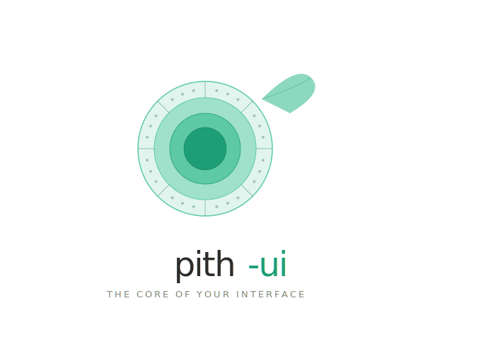

    

<h1 align="center">pith-ui-rect</h1>

This is an internal utility, not intended for public usage.

[Pith UI](https://github.com/pith-ui/pith-ui) is a Rust port of [Radix](https://www.radix-ui.com/primitives).

## Documentation

See [the Pith UI book](https://pith-ui.dev/) for documentation.

## Rust for Web

